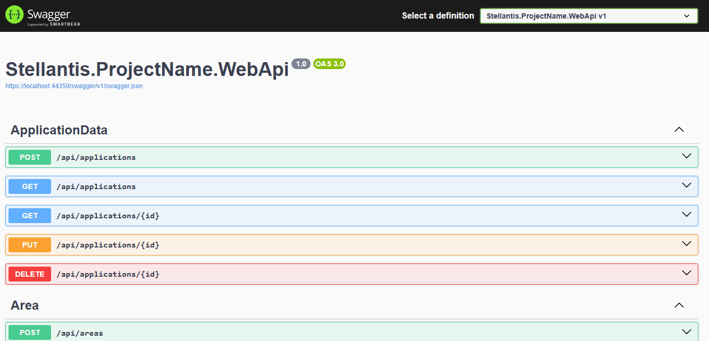

# 📌 Portal API

## 📝 Descrição

API REST desenvolvida em **.NET 8** para o sistema de gerenciamento de serviços, responsável pela **lógica de negócio**, **persistência de dados** e **integração com o frontend**.

A arquitetura segue os princípios **SOLID** e **Clean Architecture**, com **JWT para autenticação**, **documentação Swagger** e suporte a **operações em tempo real** via SignalR.

---

## 🚀 Tecnologias Utilizadas

- **Backend:** .NET 8, ASP.NET Core Web API
- **Persistência:** Entity Framework Core (SQLite/InMemory)
- **Validação:** FluentValidation
- **Mapeamento:** AutoMapper
- **Autenticação:** JWT Bearer
- **Real-time:** SignalR
- **Documentação:** Swagger UI
- **Testes:** xUnit, Moq

---

## 🏅 Badges


---

## 🖼 Visual

<p align="center">
  
</p>

---

## 💻 Como Rodar o Projeto Localmente

### 🔹 Pré-requisitos

- **.NET 8 SDK**
- **Visual Studio 2022** ou **VS Code** 

### 🔹 Passos

```bash
# Clonar o repositório
git clone [https://gitlab.fcalatam.com/fca/ams/portal/portal-api.git](https://gitlab.fcalatam.com/fca/ams/portal/portal-api.git)

# Acessar a pasta do projeto
cd portal-api

# Restaurar dependências
dotnet restore

# Executar a aplicação
dotnet run
```
Acesse: http://localhost:5000/swagger ✅
---
### 📂 Estrutura de Pastas (Resumo)

src/
  ├─ Application/     # Casos de uso e serviços
  ├─ Domain/          # Entidades e interfaces
  ├─ Infrastructure/  # Implementações de persistência
  ├─ WebApi/          # Controllers e configuração
  └─ Tests/           # Testes unitários e de integração

---

 ### 🤝 Como Contribuir

1. Crie uma branch a partir da `develop` seguindo o padrão:  
   - `feature/nome-da-feature`  
   - `fix/descricao-do-bug`  
   - `hotfix/descricao`  

2. Commits devem ser claros e objetivos:  
   - `feat: descrição`  
   - `fix: descrição`  
   - `docs: descrição`  

3. Sempre abra um **Merge Request** para revisão antes de subir para a branch principal.  
4. Mantenha cobertura de testes ≥ 80%.
5. Siga as convenções de código do projeto e mantenha o Swagger atualizado.

---
### 📜 Licença

Este projeto está licenciado sob a licença **MIT**.

---

### 📊 Status do Projeto

🔄 **Em desenvolvimento**